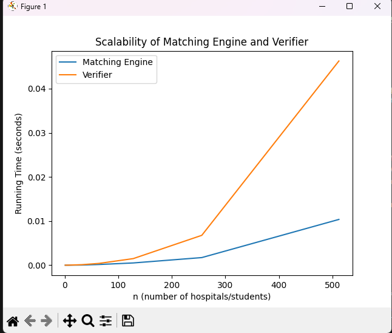

# Programming-Assignment-1-Matching-and-Verifying
Implement the Gale Shapley algorithm for the hospital-student stable matching problem

Students:  
- Anthony Cao, 22989899
- Howard Miller, 58273949

Source Code:
- Matching Engine - src/matchingEngine.py
- Verifier - src/verifier.py
- Input - data/sampleData.txt
- Output - data/example_out.txt

Instructions:
- clone the repository
- ensure the input file is ready
    - the input file should be in data/sampleData.txt
- to run the program -> go to the source directory
    command: python3 src/main.py

Assumptions:
- This is a hospital-centric approach, where the hospital makes the offers to students

Graph/Solution:  
The graph shows that as the number of hospitals and students increase, the matching engine and the verifier grows quadratically. When input size doubles, the running time increases by about four times.  

- For both the Matching Engine and Verifier their Big O is O(n^2)
Matching Engine Big O is O(n^2) because it is dependent on the total number of proposals made. in the worst case the total items in all preference list is n * n = n^2. In the graph you can observe it has a smaller slope than the verifier because it doesn't always go to the worst-case 

Verifier Big O is O(n^2) because it is has to check all of the pairs. You have to check each hospital and then check each preference list. On the graph it has a steeper slope than the Matching algorithm because it can't skip work and has to go through each one